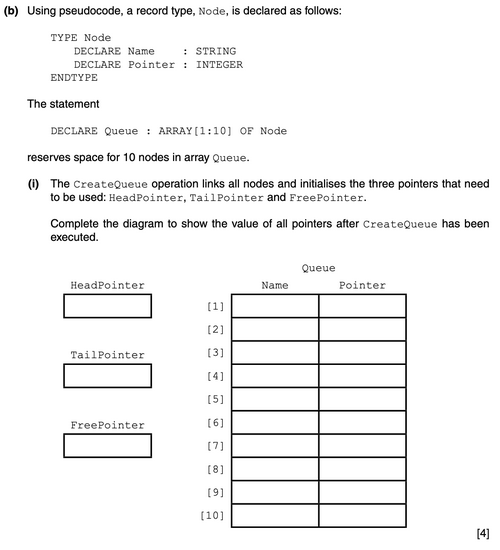

# 19&20
## ADT
- Abstract Data Type
- Null pointer is a pointer that doesn't point to another address (9608/42/M/J/17)
### Stack
- Linear structure
- Last in first out
- Has top and base stack pointers
- Uses push to add items to top of stack
- Uses pop to remove items from top of stack
- 
**Uses of stack**
- Recursion
- Implementation of ADTs e.g. linked lists 
- Procedure calls
- Interrupt handling (storing contents of registers etc) 
- RPN calculation

### Linked List
- Often implemented as an array
- If they ask you to fill in a table, the free pointer is the first free index
#### Example:

### Queue
They like to implement queues with linked lists which they like to implement with arrays.
- Linear structure
- First in first out structure
- Has start and end of queue pointers
- Can be circular
- Uses enqueue to add item to end of queue
- Uses dequeue to remove item from start of queue

#### Question examples
##### Signature Cambridge Queue Initial State
Empty queue typical characteristics you should know:
- Head pointer and tail pointer are 0 when the array is indexed from 1
- It makes sense for the free pointer to be the first index of the array

##### Some operations on queue

### Binary Tree
- Each node can have up to two child nodes  
- Parent node is above, and child nodes follow  
- Each node contains the data and pointer(s)  
- Has a root node  
- Can have leaf nodes  
- Can be output/searched in-order/post-order/pre-order  
- Can be ordered or unordered  
- Description of adding a new node // Description of ordered tree

### Hash table
- Key calculated from value
- ...(key) that represents a location // stores values in key locations
- Key used to access location
- Description of managing collisions
## Low-Level Programming
### Tricks
- XOR self with 1's to get 1's complement (equivalent to flipping each bit)
- XOR with self to get 0's
- AND self with mask - where mask is 1 bits will be kept – use it for making some bits 0
- OR is bitwise addition – use it for making some bit 1. If you want a certain bit to be 1, e.g. 2nd bit from the right, do [value] OR 00000010
- AND is bitwise multiplication
- Logical shift – zeroes introduced
- Arithmetic shift – circular 
- Shifting left = multiplying by 2
- Shifting right = dividing by 2
## OOP
Getter: a method to access its associated attribute
Setter: a method to set the value of its associated attribute
Constructor: a special type of method that is called to create a new object and initialize its attributes
Property: a class member that includes the attribute and also getter and setter method calls to access/set the attribute value

Public attributes – attributes that can be accessed *not* only inside the class definition
Private attributes – attributes that can be accessed **only** inside the class definition and won't be inherited

(9608/42/O/N/20)
Good practice to declare class attributes as private because:
- Gives limited access to attributes as it can only be accessed by classes own method
- Ensure they are hidden 
- So that they are not changed accidentally
- Using set methods allows for validation when updating value

### Inheritance
- Inheritance is when a class can be made to be able to use attributes/methods of another class
- Inheritance diagram shows who inherits from who
- super classes above, sub classes below
- sub classes point to the super class they inherit from
- **Polymorphism** is a feature that allows sub classes to **override** methods defined by their super class so that the sub class method behaves differently to the one of the super class 

**How getter and setter methods provide security (9608/42/M/J/19)**

**Inheritance diagram example**

### Containment
- A feature of a programming language that allows one object to contain objects of another class
- The contained objects can be operated on by the containing class's methods

### Encapsulation
- The combining of class attributes and methods that manipulate those attributes
- …may include limiting the access to the attributes
## Recursion
Essential features (9618/32/O/N/21):
- Has base case
- Has general case
- Function calls itself
- Changes state as it moves toward base case
- Unwinding occurs when base case is reached

Stack suitability (9618/32/O/N/21):
- LIFO data structure
- Each recursive call pushed onto stack
    - ...calls popped off when function nears end
- Enables unwinding in correct order

## Performance of Algorithms
Factors affecting performance of sorting algorithm:
- Initial order of data
- Number of items to be sorted
- Efficiency of the algorithm

https://www.youtube.com/watch?v=__vX2sjlpXU – Big-O notation
Time complexity of binary search = $O(log(n))$ where $log(n) = log_{2}(n)$
__

## Insertion sort
Don't forget bubble sort, I can't be bothered to write about both or either properly.

