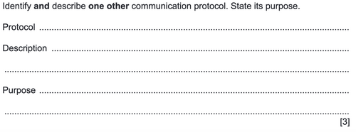
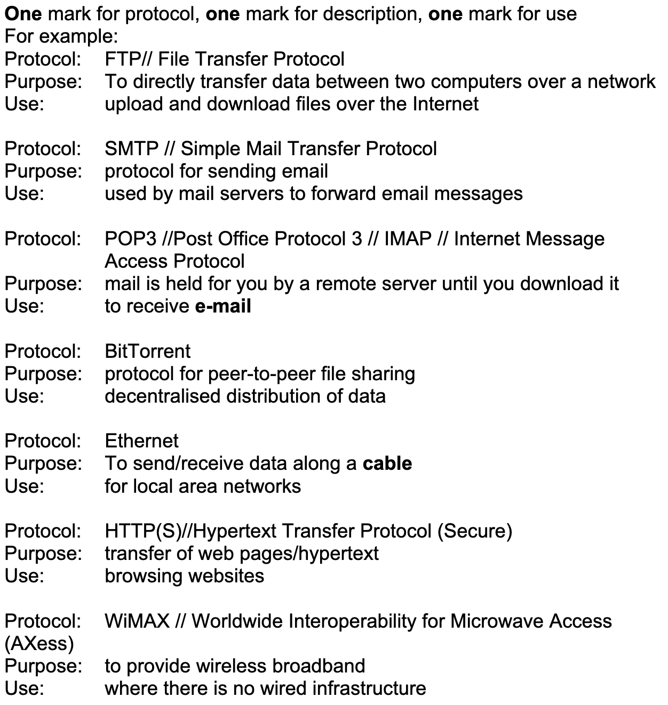

# Communication and Internet Technologies
## Protocols
- **_A set of rules/standards for successful transmission of data_**
- A port and an IP address together are called a socket

**Need for protocols (9608/33/M/J/21 + 9608/33/O/N/19)**
- So that all data uses the same format
- Provide rules for communication
- All sending/receiving happens according to the same rules
- So that communication is independent of software and hardware

### TCP/IP Protocol Suite
**Description (9608/33/O/N/20)**
- Set of protocols for transmitting data
- Stands for Transmission Control Protocol and Internet Protocol
- Layered model
    - ...with 4 layers
- 4 layers named (in order scores marks)

(TCP is stands for *Transmission* Control Protocol, not Transport Control Protocol. MS from above has an error.)

**4 Layers (9608/33/M/J/21):**
- Application layer - handles access to services//manages data exchange//defines protocols used
- Transport layer (TCP part) - handles forwarding of packets//sets up and maintains connection
- Internet layer (IP part) - handles routing
- Data Link layer - handles how data is physically sent

(9608/33/O/N/18)
**More Functions of TCP part**
- Host to host communication
- Breaks up application data into packets
- Adds sequence number to TCP packet headers
- Sends/receives packets to/from internet layer
- Does error checking (calculates and checks checksum)
- Handles retransmission of lost/corrupted packets
- Reassembles packets into correct order

**More Functions of IP part**
- Routes packets between networks
- Adds IP header
- Encapsulates data into a **datagram**
- Passes data to/from network access layer/transport layer

**More Functions of Data Link Layer**
- To ensure correct network protocols are followed
- To enable the upper layers to access the **physical medium**
- To be responsible for transporting data within the network
- To format the data into frames for transmission
- Maps IP addresses to MAC addresses

### Application Layer Protocols
_Purpose - the reason for which something is done or created or for which something exists
Use - the value or advantage of something
Description - a spoken or written account of a person, object, or event_
– Oxford Dictionary of English

It's useful to keep the definitions in mind because there are silly questions like (9608/33/M/J/21):

Which have even sillier accompanying mark schemes where a different question is answered:
 
So just answer the question and really, really hope that you will be spared.
The best way to answer is probably to just write half of the description on one line and the other half on the next line.

#### BitTorrent
- Used for file sharing
- Peer-to-peer model
**How it works (9618/03/SP/21)**
- Computer has BitTorrent client software
- Computer downloads torrent descriptor file and joins swarm *using the software*
- Server called "tracker" keeps records of all computers in the swarm
- …and shares their IP addresses so that they can connect to each other
- Torrent is split into small pieces
- At least one computer has the complete file and makes it available to swarm
- Pieces of the torrent are both downloaded and uploaded
- Once a computer has a piece of the torrent file, it can start uploading it and become a "seed"
- A leech is a computer that downloads much more than it uploads

#### HTTP/HTTPS
Protocol for transfer of web pages from server to client
#### FTP
Protocol for interactive file transfer
#### IMAP
Protocol for retrieving email messages from a mail server over a TCP/IP connection
#### Email
- SMTP - for sending emails
- POP3/IMAP - for receiving emails

### Transport Layer Protocols (ie. TLS/SSL)
- SSL(Secure Sockets Layer) protocol is deprecated
- TLS(Transport Layer Security) protocol is the successor

**Purpose (9618/32/O/N/21)**
- SSL/TLS provide security for communication over internet
- Provide encryption and data integrity
- Allow parties to identify and authenticate each other
- ...and to communicate with **confidentiality and integrity**

**How are they used?/How do they work?**
- SSL/TLS connection initiated by application
    - which becomes client application
- Application which receives the communication becomes the server
- Session begins with handshake
- Client requests server's digital certificate
- Client verifies the certificate
    - ...and obtains the server's public key
- Symmetric session keys generated

## Switching
### Packet Switching
**Suited to**
- Where synchronisation is not necessary
- Where error checking is needed
- Where real time transmission not needed

**How it's used/How it works (9618/32/O/N/21)**
- Message divided into small, same-sized pieces called packets
- Packet has header and a payload
    - Header has
        - Source IP address
        - Destination IP address
        - Sequence number
        - IP version
        - Time to Live
        - Packet length
    - Header needed to store information about packet so original message can be reconstructed
- Each packet sent independently and may take different routes
- Packets may arrive out of order
- ...and must be reassembled into original message at destination
- If packet(s) missing or corrupted, retransmission request sent

If they ask why does someone use packet (or circuit) switching, answer with the advantages of doing so (but not always, try to include why it's suited to the given use as well).
**Advantages**
- Bandwidth can be shared
- Makes best use of available channels
- Circuit does not need to be established at start of communication
- More secure + robust since different paths taken by packets
- Does error checking 

**Disadvantages**
- Must wait until all packets received to put them in order
- Video and sound may not be synchronised
- Could be insufficient bandwidth if others are using it

### Circuit Switching
**Suited to**
- Live video

**How it's used/How it works (9608/32/O/N/20 + 9608/33/M/J/20)**
- Circuit established
    - ...between sender and receiver
    - ...established before communication starts
    - …used for full duration of communication
- All data travels down one dedicated channel
- Full bandwidth used
- Connection dropped at end of communication

If they ask why does someone use circuit (or packet) switching, answer with the advantages of doing so (but not always, try to include why it's suited to the given use as well).
**Advantages**
- Full bandwidth because dedicated channel
- Better synchronisation than packet switching
- No delays
- Data arrives in order sent

**Disadvantages**
- Bandwidth not available for others
- Lower security because easier to intercept since only one route used
- Extra time required at start to set up circuit
- Less reliable because if route fails communication cannot continue

### Router
**Function in packet switching**
- Router reads packet header
- Reads IP address of destination
- Has a routing table, containing info about...
    - ...available hops
    - …status of different routes
- Decides best route for packet
- Sends packet down this route