# Hardware

## Truth Table and K-map
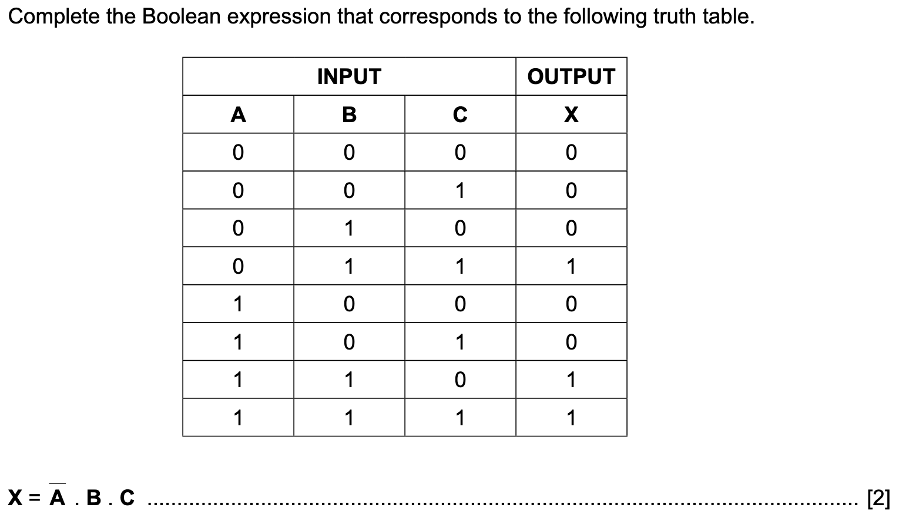
Find where output is 1. Look at every input letter. If it’s a 0 put barred letter, if  it’s 1 then just put the letter. Add product of your letters to the expression you already have. Repeat for all rows.

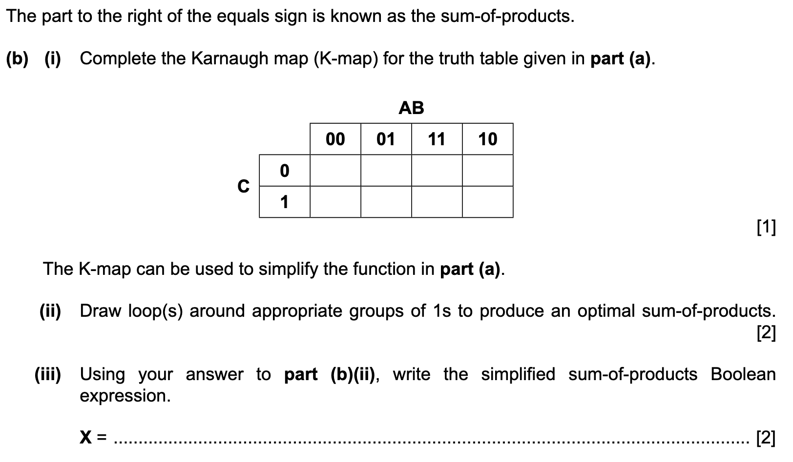

0 corresponds to bar, 1 corresponds to no bar. Takes every product in the expression from previous question and see what position to put a 1 in. e.g. A̅.B.C mean AB -> 01 and C->1. So put a 1 in (01, 1) (top, side).
  
Circle all groups which have 2^n 1’s.
For every group look at the top and see what letter doesn’t make a difference.
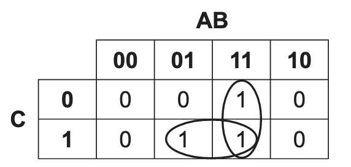
Horizontal group: A has no effect but B is always 1 and C is always 1. Write B.C

Vertical group: A and B always 1 and C has no effect. Write A.B

Answer: A.B + B.C

## Half adders and full adders and algebra
When they ask you to give a proper label for adder and they ask why is this better just say that you called it
- sum because that output represents the sum part of the addition of two/three bits 
- carry because that output represents the carry part of the addition of two/three bits.
- two for half adder, three for full adder
### Half adder
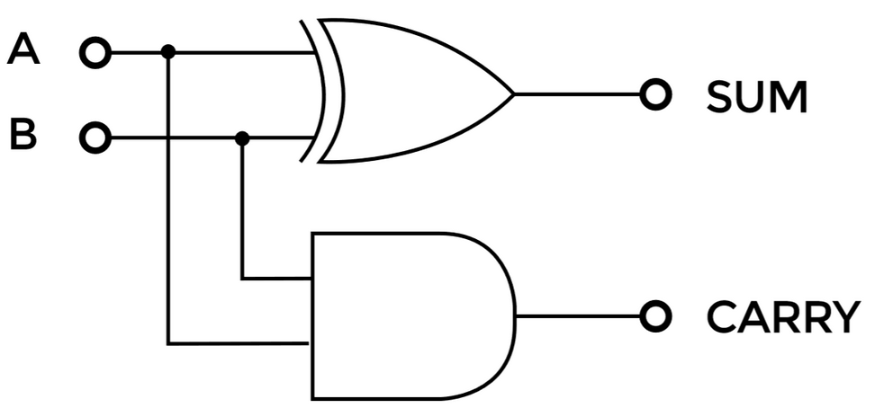
### Full adder
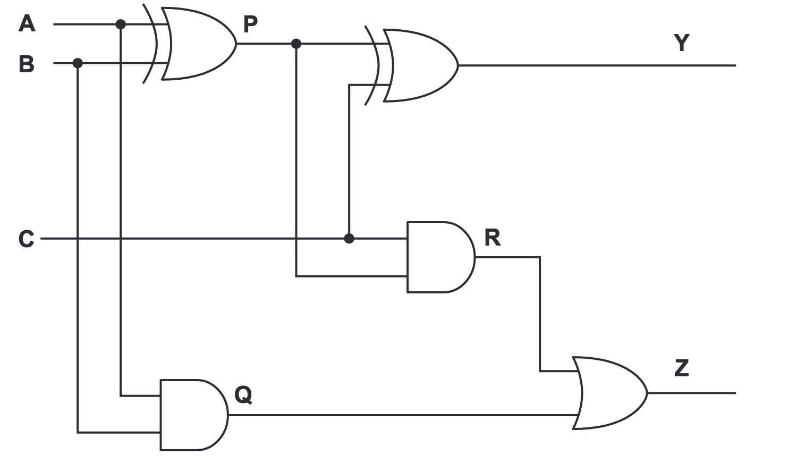

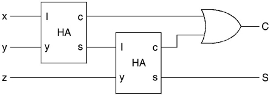

**------------------------------------------------------------------------------------------------**
### Boolean algebra
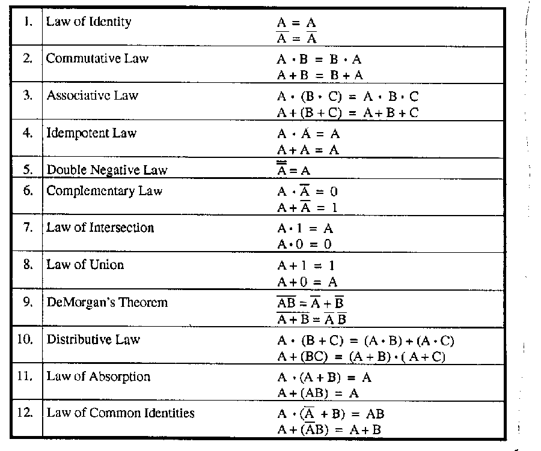
How to derive:
- Law 10 second line
(A+B) • (A+C)
AA + AB + AC + BC
A + AB + AC + BC
A•(1+B+C) + BC
A + BC
- Law 11 - Very similar derivation as Law 10
- Law 12 first line
AA̅+AB
AB
- Law 12 Second line
A + A̅B
A + A̅B + AB
A + B(A̅ + A)
A + B
### Questions
#### Adder
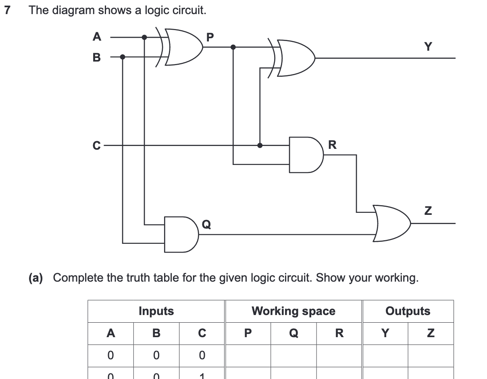
Final OR gate is the carry.
Final XOR gate is the sum.
Just add the 0's and 1's.
#### Boolean algebra
Question asks to simplify using laws.
Use boolean algebra laws.

If there are 3 terms (or if there are an odd number in general work until you get to 3 terms) e.g. AB̅C̅ + ABC̅ + ABC then it's hard to use the laws.
Trick: Pair two terms where you can factor out n-1 letters where n is the number of letters per term:
(You are trying to make it so that in the brackets you have one letter plus NOT(same letter))
(AB̅C̅ + ABC̅) + ABC
And add one of the terms in that **initial** pair to the lone term so that you can factor out n-1 letters from that pair as well.
Here the first term is easy to deal with (Law 6)
AC̅(B̅+B) + ABC + ABC̅
AC̅ + AB(C+C̅)
AC̅ + AB
A(C̅+B)
## Flip-flops
- Sequential logic circuits//electronic components
- Have 2 states  ~ bi-stable
- **Store 1 bit, 0 or 1**
- **Used in memory**//memory can be created with flip-flops
### SR flip-flop
Don't think about the letters, know the relative position relationship - draw a cross on the diagram, the connected letters will be equal. 
- Q and Q̅ MUST be complements.
- Problem - invalid state exists and signals may arrive at different times.
#### Nand type
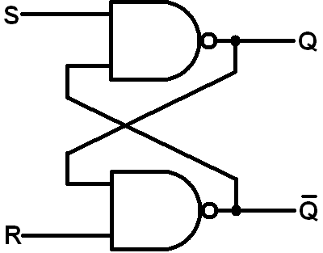
**00 - invalid state - unstable**
11- no effect
TOP-LEFT = BOTTOM-RIGHT
BOTTOM-LEFT = TOP-RIGHT
or just TOP(one side) = BOTTOM(other side)

#### XOR type
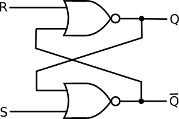
**11 - invalid state - unstable**
00 - no effect
TOP-LEFT = BOTTOM-RIGHT
BOTTOM-LEFT = TOP-RIGHT
or just TOP(one side) = BOTTOM(other side)
### JK flip-flop
J = SET
K = RESET
IDK what we are setting and resetting.

Characteristics:
- No invalid state//JK is stable (advantage) so Q and Q̅ always complements.
- Has CLK pulse **for synchronisation (of inputs)**

Functions:
- When CLK is 0, outputs don't change. When CLK is 1 outputs may change.
- When J=K=1 toggles the outputs (makes output logical complement of previous output)
- TOP = TOP ie. J=Q
- BOTTOM = BOTTOM ie. K=Q̅
- No cross
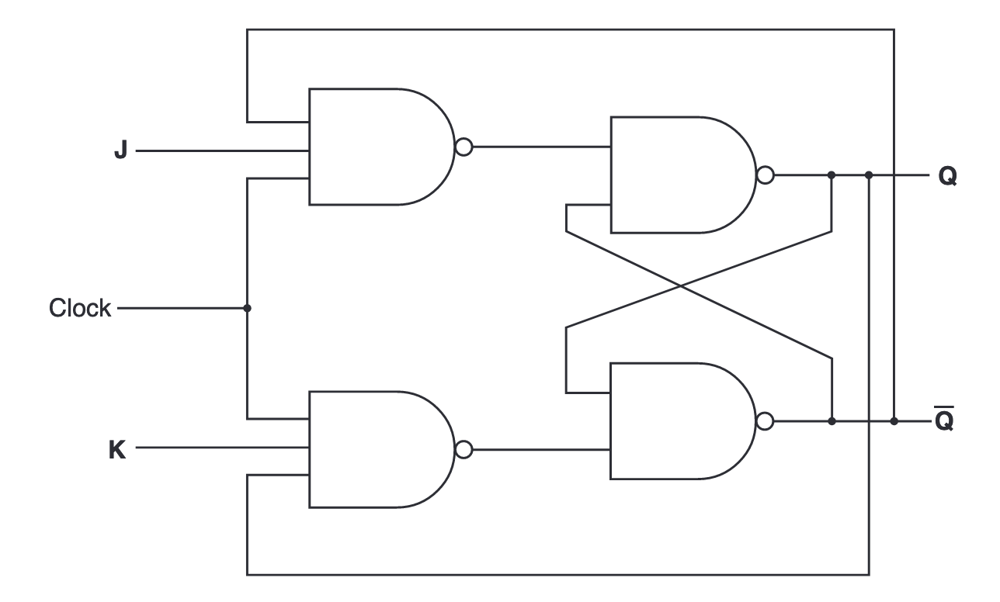

## Virtual Machine
- VM is software
- That emulates a different computer system
- Allows multiple guest OS's to run on one computer
- The VM is run under the host OS
- Host OS interacts directly with hardware

**Role of VM software (9608/32/O/N/20)**
- Create/delete/manage virtual machine
- Emulates the hardware
- Protect each virtual machine from actions of another virtual machine so instances of MyApp can be run together _(from who? Boogieman?)_ 

Advantages:
- Can try a new OS
- Can test if software will work on different OS
- No need to buy new computer system
- …so cheaper
- Multiple OS's on same hardware

Disadvantages:
- More code executed
- ...so lower performance than with physical computer system
- Can be hard to set up
- Not possible to emulate some hardware 

**Application in guest OS makes a request to guest OS to get data from file**
- Guest OS handles request as normal
- I/O request translated by VM software into instructions for host OS
- Host OS gets data from file
- Host OS passes data to VM software
- VM software passes data to guest OS
- Guest OS passes data to application
## RISC & CISC & Pipelining & Parallelism
### RISC & CISC
RISC - Reduced Instruction Set Computer
- Few simple instructions - one cycle - few formats
- Fixed length instructions
- Many registers
- Easier pipelining
- Hardwired Control Unit
- Emphasis on software
- Uses more RAM
- Only store and load for memory access
CISC - Complex Instruction Set Computer
- Many complex instructions - multiple cycles
- Variable length instructions
- Fewer registers
- More difficult pipelining
- Microprogrammed Control Unit
- Emphasis on hardware
- Uses less RAM
- Many addressin modes

Addressing modes are:
- Immediate - value given
- Direct - get from some address
- Indirect - get from some address then use value stored there to get from another address
- Indexed - uses index register - get from: operand + IX
- Relative - get from address of first instruction + operand
 
### Pipelining
- Pipelining - instruction level parallelism applied to execution of instructions during FE cycle.
- Execution of instruction split into stages.
- When one instruction is done with a stage, the same stage of another instruction can be executed.
- An instruction can start executing before the previous one has finished. 
- Several instructions can be processed simultaneously.

- There can be a data dependency issue where one instruction is not done with generating a result that is used by the subsequent instruction. 
- Solution: swap the instruction that wants to access to early with the next one (that doesn't depend on the result).

### Parallelism
S = single
M = multiple
I = instruction
D = data set
SISD - One processor - basic
SIMD - Each processor uses data in dedicated memory - graphics
MISD - 
MIMD - processors have own partition in shared memory - massively parallel computer 

**Key words:** 
- Processors, Intructions, Data sets
- Many **processors** then **execute** same and different depending on single or multiple

Massively parallel computer:
- Many separate processors
- ...Working together
- ...Simultaneously
- ...Communicating via messaging interface - don't share bus
- Challenge is connecting the processors so that they can communicate - very complex topology - all processors need to be connected to each other

To adapt code to run on MPC:
- Split into blocks
- ...that can be processed simultaneously instead of sequentially
- Each block would be processed by different processor