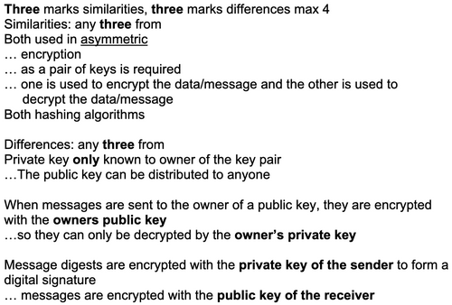

# Security
## Encryption
### Symmetric
- Single key
- For encryption and decryption

**Drawbacks:**
- Key has to be exchanged securely
- If key compromised then messages can be decrypted
- Cannot prove integrity and origin of data

### Asymmetric
- Two matching keys
- Public and private
- Share public
- Never share private
- Receiver's public key used to encrypt (produces cipher text)
- Receiver uses private key to decrypt (produces plain text)

**Advantages:**
- High security
- Allows message authentication
- Detects tampering

Interesting… the fact that public and private keys are used for different things falls under their similarities. That makes a lot of sense.

### TLS/SSL
**How it works: (9608/33/M/J/21)**
- Protocol with two layers
    - …handshake and record
- Digital certificate used for authentication
- Handshake uses asymmetric cryptography
- Session key is established
- Shared session key used for symmetric cryptography to send and receive data
- Session parameters erased at end

**Establishment of SSL(/TLS?) connection between browser and web server (9608/33/M/J/19):
- Browser requests server to identify itself
- Server sends it digital certificate
- Containing the server's public key
- Browser verifies the certificate against a list of trusted CA's
- If the certificate is valid, a symmetric session key is created
- Browser encrypts the session key with server's public key and sends it to server
- Server decrypts the session key with its private key

**Purpose**
- Provide for secure communication 
- Maintain data integrity
- Additional layer of security
- TLS provides improved security over SSL
- TLS protects this information by using encryption 
- Allows for authentication of servers and clients

**Appropriate for: (9608/33/M/J/21)**
- Accessing secure websites
- Email
- VPN
- VOIP

### Digital Certificates/Signatures
(9608/32/M/J/21)
**Digital Certificate**
Electronic document used to prove the ownership of a public key
- Obtained from Certificate Authority
- Contains
    - Owner's public key
    - Hashing algorithm to be used
    - Validity dates
    - Name of CA that issued it
    - CA digital signature

**Process of getting Digital Certificate**
- An individual (person A) who is a would-be receiver and has a public-private key pair contacts a local CA
- The CA confirms the identity of person A
- Person A's public key is given to the CA
- The CA creates a public-key certificate (a digital certificate) and writes person A's public key into this document
- The CA uses encryption with the CA's private key to add a digital signature to this document
- The digital certificate is given to person A
- Person A posts the digit al certificate on a website.

**Digital Signature**
- Ensures message is authentic
- Ensure message was not tampered with
- 
**How it works:**
- Message plain text put through agreed hashing algorithm
- Message digest produced
- Digest encrypted with sender's **private key** to produce the signature
- Receiver will put the decrypted message through the same algorithm and will decrypt the digest with sender's **public key**
- If the digest produced by receiver is same as decrypted signature, message was not tampered with.

(9608/33/O/N/20)
**Similarities of certificates and signatures:**
- Both used for authentication
- Both use owner's public key
- Both use hashing algorithms

**Differences:**
- Certificate obtain from CA, signature generated from message
- Certificate authenticates owner, signature authenticates message
- Only signature uses private key

If they ask how does digital certificate ensure message has not been altered during transmission, explain how the message is encrypted, sent, and decrypted and how digital signature is produced and verified. (9608/33/M/J/20)

### Quantum Cryptography
**Benefits:**
- Eavesdropping can be identified due to nature of quantum mechanics
- Longer keys can be exchanged
- Integrity of transferred key guaranteed

**Drawbacks**
- Difficult to set up
- Limited range

↕ ↗ is 1
↔ ↖ is 0
